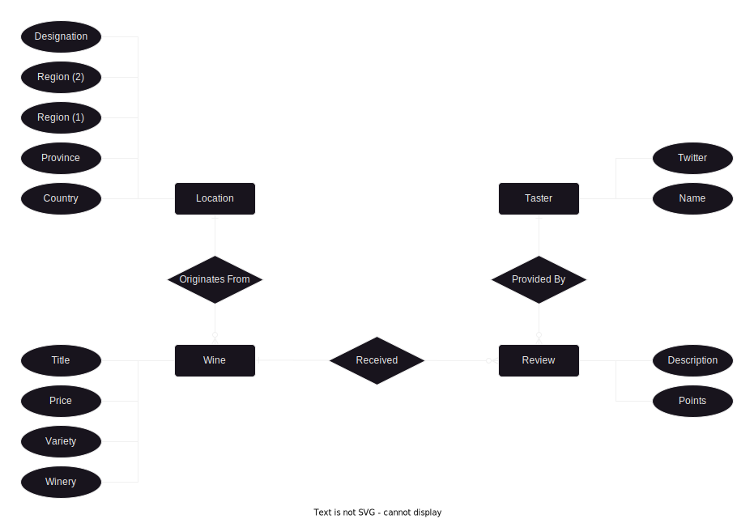

# openrefine-reproducibility
Based on [nikolausn/OpenRefine-Reproducibility-Demo](https://github.com/nikolausn/OpenRefine-Reproducibility-Demo/blob/master/Python_OpenRefine_Demo.ipynb)

## Dependencies
[Docker](https://www.docker.com/products/docker-desktop/)

## Usage
Clone the repository
```
git clone https://github.com/derek164/openrefine-reproducibility.git && cd openrefine-reproducibility
```

Start OpenRefine server and client
```
docker compose up
```

Execute OpenRefine workflow
```
docker-compose run --rm -it --entrypoint python openrefine-client /app/main.py
```

## Data
[Wine reviews](https://www.kaggle.com/datasets/zynicide/wine-reviews) scraped from WineEnthusiast. 

### Assumptions
1. Not all wineries make their wine from grapes which they grew or sourced from a local vineyard
2. Each wine is made with grapes from one location of varying specificity, from country to vineyard

### ER Diagram
